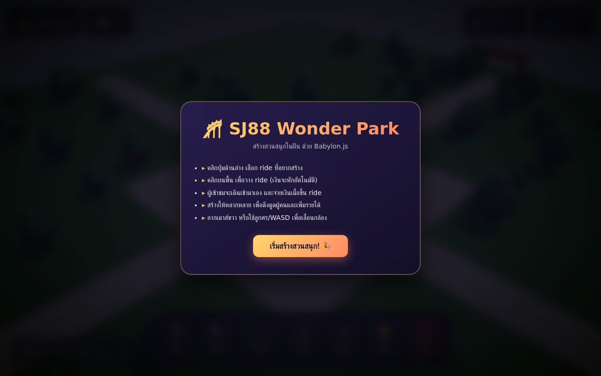
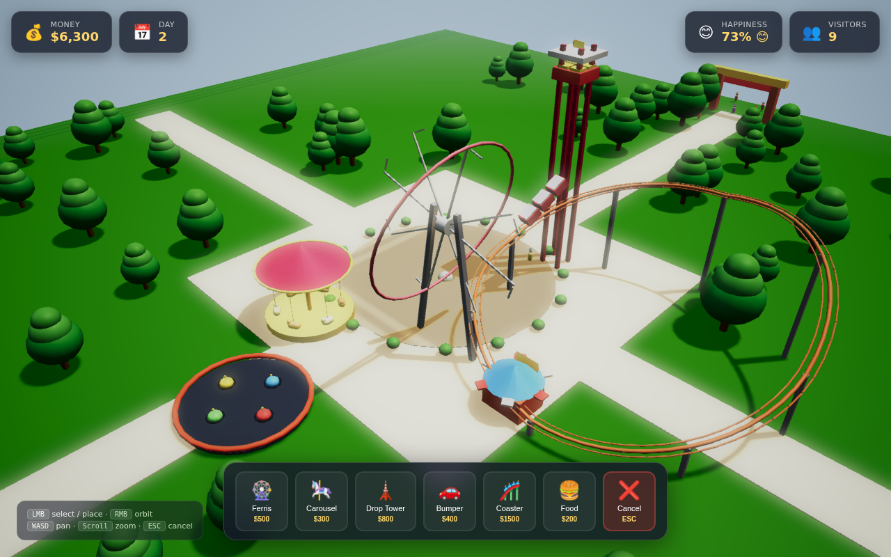
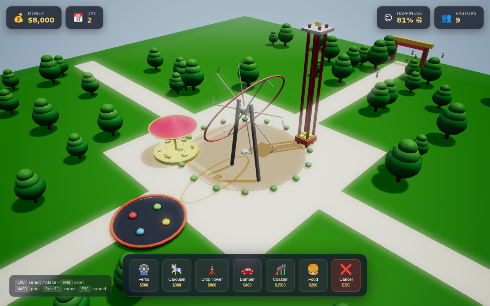

# 🎢 SJ88 Wonder Park

> Build your dream amusement park in 3D, powered by Babylon.js.

A complete browser-based tycoon game where you place rides, manage visitors, and grow your park's economy. Single-file HTML, no build step, no server required.



---

## ✨ Features

- **6 unique rides** with custom geometry, materials, and animations:
  - 🎡 **Ferris Wheel** — rotating wheel with 8 colorful pods
  - 🎠 **Carousel** — horses + striped canopy spinning around the center
  - 🗼 **Drop Tower** — lift + drop + pause cycle
  - 🚗 **Bumper Cars** — orbit-driving cars with antenna balls
  - 🎢 **Roller Coaster** — looping orange track with a 3-car train
  - 🍔 **Food Stall** — striped awning + glowing sign

- **Visitor AI** — visitors spawn at the entrance gate, wander the park, walk to rides, queue (auto-promoted when capacity opens), ride, pay, and exit when satisfied
- **Economy** — start with $10,000, deduct on placement, earn per ride completion
- **Day cycle** — day counter, happiness score, dynamic visitor spawn rate
- **Beautiful out of the box**:
  - `DefaultRenderingPipeline` with ACES tone-mapping, FXAA, bloom, vignette
  - 2048-resolution blurred exponential shadow maps
  - Procedural checker-texture ground
  - 80 procedural trees + bushes + pond + entrance arch



---

## 🎮 Controls

| Action | Input |
|---|---|
| Select / place ride | `Left Mouse Button` |
| Orbit camera | `Right Mouse Button` drag |
| Pan camera | `WASD` or arrow keys |
| Zoom | Mouse wheel |
| Cancel placement | `ESC` |

---

## 🚀 Run Locally

No build step. Just open the file:

```bash
# Option 1: open directly
open index.html

# Option 2: serve via Python
python3 -m http.server 8000
# → http://localhost:8000
```

The game uses Babylon.js v9.x from CDN — an internet connection is required on first load.

---

## 🛠️ Tech Stack

- **Babylon.js v9.15** — Microsoft-backed WebGL/3D engine
- **Standard Materials** with custom specular + emissive
- **ShadowGenerator** with blur exponential shadow maps
- **DefaultRenderingPipeline** for post-processing (bloom, ACES, FXAA, vignette)
- Pure **vanilla JavaScript** — no React/Vue/build tooling
- Single 57 KB HTML file — portable, easy to share

---

## 📐 Architecture Notes

A few patterns that kept the code tidy:

- **`makeMat(name, color, opts)`** — one-line material creation helper (diffuse + specular + emissive + alpha)
- **`makeCheckerTexture(name, size, c1, c2)`** — `DynamicTexture` checker pattern for grass + plaza
- **`tagRideMeshes(ride)`** — marks child meshes with `metadata = { isRide, rideRef }` so hover info popups work via `scene.pick`
- **`isValidPlacement(pos)`** — collision check (8-unit min distance from other rides, away from entrance + pond, in bounds)
- **Visitor state machine** — `entering → wandering → walking_to_ride → queuing → riding → wandering | leaving → gone`
- **Auto-promote queue** — main loop walks rides and promotes first queuer when capacity opens
- **Roller coaster track** — 60-point circle + per-segment cylinders oriented via `Vector3.Cross` + `Quaternion.RotationAxis`

---

## 🎯 Roadmap

- [ ] Save / load park to localStorage
- [ ] Multi-day visitor satisfaction trends
- [ ] Ride upgrades (level 2/3 with bigger income + new visuals)
- [ ] Park rating + reviews
- [ ] True day/night cycle with park lighting + lit rides

---

## 📸 Gallery

### Populated park after ~10 seconds


---

## 📄 License

MIT — do whatever you want, just don't blame me if a roller coaster derails.

Built by **SJ88** 🎢