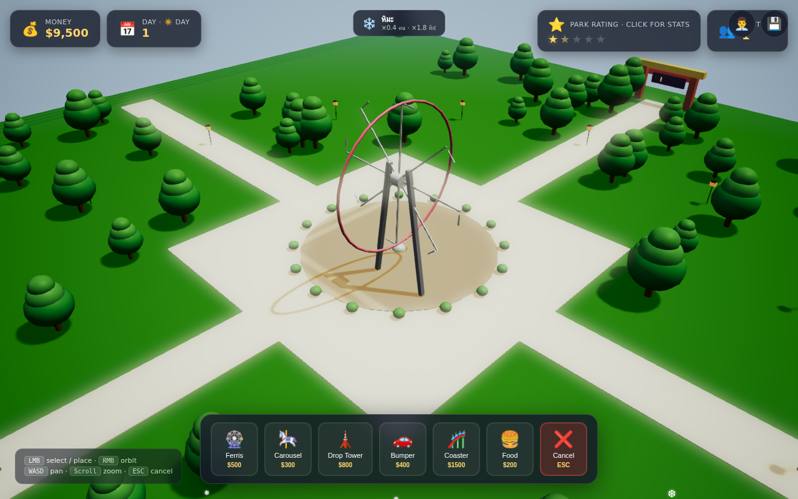
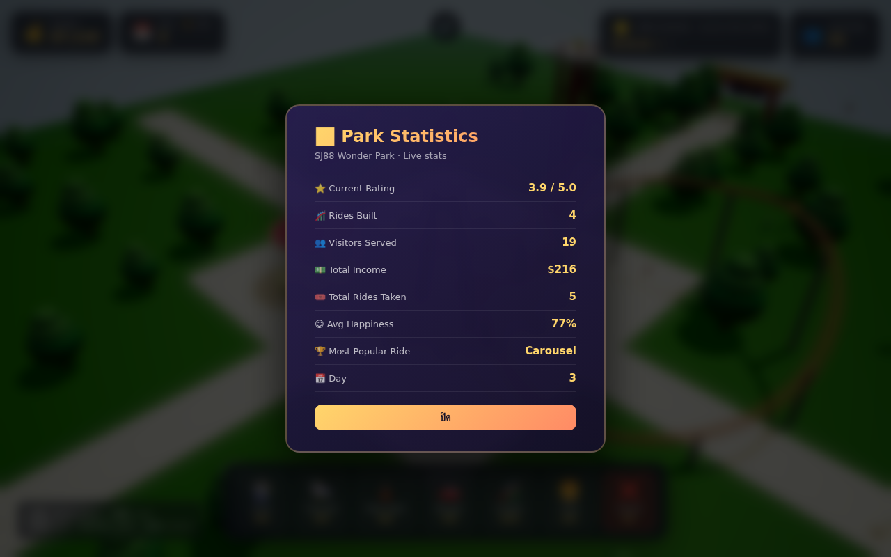
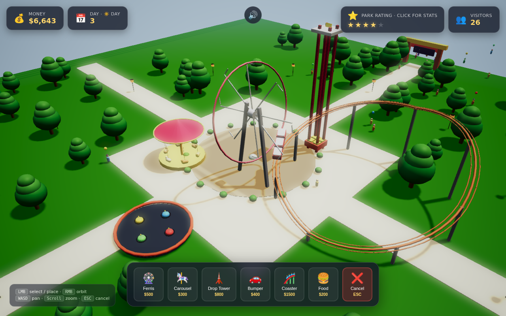
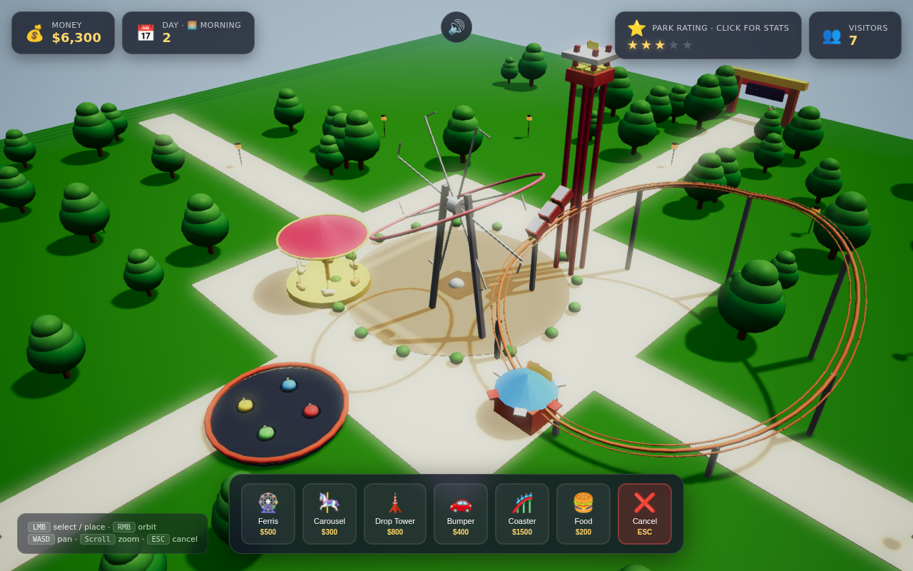
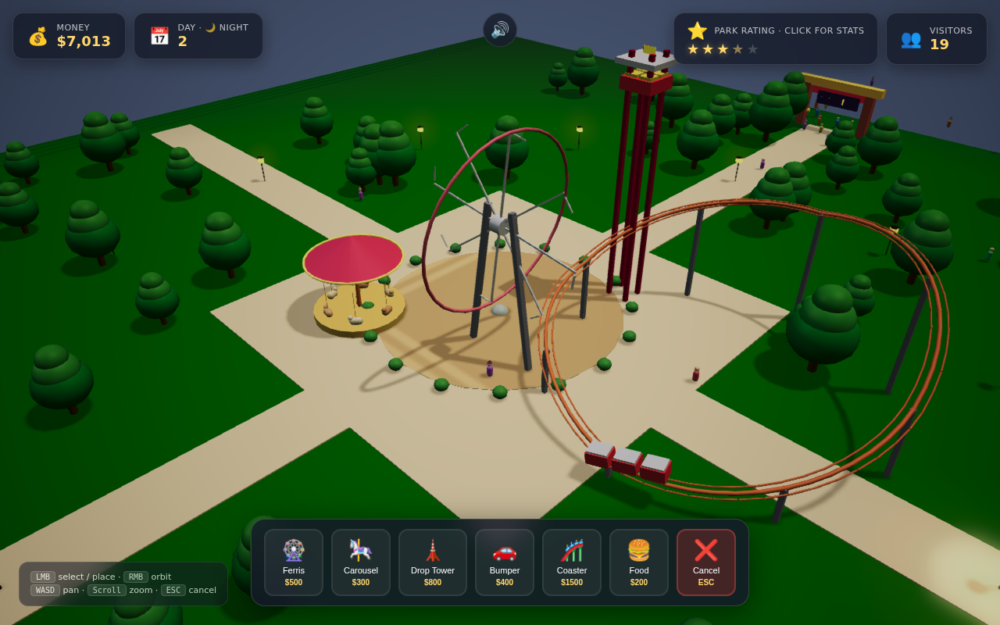

# 🎢 SJ88 Wonder Park

> Build your dream amusement park in 3D, powered by Babylon.js.

A complete browser-based tycoon game where you place rides, manage visitors, grow your rating, and watch the flywheel compound. Single-file HTML, no build step, no server required.

## 🌐 Live

🎮 **https://sj88wonderpark.sj88ai.com/** — Official deployment with real Let's Encrypt SSL

> Also hosted on test servers (HTTP):
> - http://178.83.121.75:54000/  (port 54000, plain HTTP)
> - https://178.83.121.75:54400/  (port 54400, self-signed cert)


---

## ⭐ v1.2 — "Complete Tycoon" (NEW)

Three new systems close the loop and turn the park into a full tycoon:

### 💾 Save/Load (retention)
- **Auto-save** every 30s to localStorage
- **3 save slots** with Day/Money/Ride count
- **Export/Import JSON** for backup or transfer
- Persists money/day/rating/totals/rides/staff/weather

### 🌦️ Weather System (dynamic challenge)
- **5 states**: sunny / cloudy / rain / storm / snow
- Each modifies **spawn rate** (0.3-1.0×), **tip bonus** (1.0-1.8×), **visitor mood**, and **sky tint**
- **CSS particles**: rain drops, snow flakes, fog overlay, storm lightning
- **Auto-rotates** every 90s

### 👨‍💼 Staff System (management depth)
- **3 roles** with NPC meshes: Janitor ($30/d) · Mechanic ($60/d) · Mascot ($80/d)
- **Patrol AI** — they walk around the park
- **Hire cost** 3 days upfront; **daily payroll** auto-deducted
- Effects: Janitor → +happiness, Mascot → +20% spawn rate
- Continuous money sink → flywheel keeps spinning



---

## ⭐ v1.1 — "Living Park" (NEW)

A rating flywheel that compounds: **better park → more visitors → more income → better park.**

### The Core Loop

- **⭐ 5-Star Park Rating** — computed live from diversity (max 1.5★), happiness (max 1.5★), income rate (max 1★), and crowd density (max 1★).
- **Spawn rate** = `base × (rating/5)²` — a 5★ park spawns visitors **~3× faster** than a 1★ park.
- **Income multiplier** = `1 + 0.1 × rating` — a 5★ park earns **+50% per ride**.

### Visual Juices

- 🏮 **12 lanterns** ring the park, glowing warm orange and flickering gently at night
- 🌅 **Day/Night cycle** (60s) — sun arcs, sky shifts, lanterns auto-turn on at evening
- 🎈 **Balloons** on 20% of visitors (kids more likely) bobble as they walk
- 📸 **Photo-taking** — 1 in 20 wander step chance to stop and "take a photo" for 2 seconds
- 💰 **Gold coin particles** fly up from the money counter whenever a ride completes
- 🎆 **Confetti burst** when crossing 1★/2★/3★/4★/5★ milestones (big burst at 4★+)
- 🏆 **Entrance billboard** — 3D star rating plaque visible at the gate

### Game Systems

- 📊 **Stats Modal** — click the rating card or day counter for live stats (income, popular ride, avg happiness, etc.)
- 🔊 **Sound effects** (Web Audio synthesis) — coin cha-ching, ride ding, star-up arpeggio, click tick
- 👨‍👩‍👧 **Visitor groups** — 30% of spawns are families of 2-3
- 🛎️ **Sound toggle** — 🔊/🔇 button in the top-center
- 🌙 **Time-of-day indicator** — 🌅 Morning / ☀️ Day / 🌇 Evening / 🌙 Night in the HUD





---

## ✨ Rides (6 unique, fully animated)

- 🎡 **Ferris Wheel** — rotating wheel with 8 colorful pods
- 🎠 **Carousel** — horses + striped canopy spinning around the center
- 🗼 **Drop Tower** — lift + drop + pause cycle
- 🚗 **Bumper Cars** — orbit-driving cars with antenna balls
- 🎢 **Roller Coaster** — looping orange track with a 3-car train
- 🍔 **Food Stall** — striped awning + glowing sign

| Ride | Cost | Income/ride | Capacity | Fun |
|---|---|---|---|---|
| 🎡 Ferris Wheel | $500 | $30 | 8 | ★★★ |
| 🎠 Carousel | $300 | $15 | 6 | ★★ |
| 🗼 Drop Tower | $800 | $40 | 4 | ★★★★ |
| 🚗 Bumper Cars | $400 | $20 | 4 | ★★ |
| 🎢 Roller Coaster | $1500 | $60 | 12 | ★★★★★ |
| 🍔 Food Stall | $200 | $10 | ∞ | ★ |

---

## 🎮 Controls

| Action | Input |
|---|---|
| Select / place ride | `Left Mouse Button` |
| Orbit camera | `Right Mouse Button` drag |
| Pan camera | `WASD` or arrow keys |
| Zoom | Mouse wheel |
| Cancel placement | `ESC` |
| Open stats | Click the ⭐ Rating card or 📅 Day card |
| Toggle sound | Click 🔊 top center |



---

## 🌙 At Night



Lanterns flicker, sky darkens, ride emissives glow. The park keeps running — night visitors pay the same.

---

## 🚀 Run Locally

No build step. Just open the file:

```bash
# Option 1: open directly
open index.html

# Option 2: serve via Python
python3 -m http.server 8000
# → http://localhost:8000
```

The game uses Babylon.js v9.x from CDN — an internet connection is required on first load.

---

## 🛠️ Tech Stack

- **Babylon.js v9.15** — Microsoft-backed WebGL/3D engine
- **Standard Materials** with custom specular + emissive
- **ShadowGenerator** with blur exponential shadow maps
- **DefaultRenderingPipeline** for post-processing (bloom, ACES, FXAA, vignette)
- **Web Audio API** for procedural sound effects (no audio files)
- Pure **vanilla JavaScript** — no React/Vue/build tooling
- Single 76 KB HTML file — portable, easy to share

---

## 📐 Architecture Notes

A few patterns that kept the code tidy:

- **`makeMat(name, color, opts)`** — one-line material creation helper (diffuse + specular + emissive + alpha)
- **`makeCheckerTexture(name, size, c1, c2)`** — `DynamicTexture` checker pattern for grass + plaza
- **`createStarTexture(state)`** — `DynamicTexture` for the entrance billboard stars
- **`tagRideMeshes(ride)`** — marks child meshes with `metadata = { isRide, rideRef }` so hover info popups work via `scene.pick`
- **`isValidPlacement(pos)`** — collision check (8-unit min distance from other rides, away from entrance + pond + lanterns, in bounds)
- **Visitor state machine** — `entering → wandering → walking_to_ride → queuing → riding → wandering | leaving → gone`
- **Photo-taking state** — temporary `photo` state for visual life
- **Auto-promote queue** — main loop walks rides and promotes first queuer when capacity opens
- **Roller coaster track** — 60-point circle + per-segment cylinders oriented via `Vector3.Cross` + `Quaternion.RotationAxis`
- **Lantern flicker** — `intensity = baseIntensity × nightFactor × (0.92 + sin(t × 4 + phase) × 0.08)` for natural flame

---

## 🎯 Roadmap

- [ ] Save / load park to localStorage
- [ ] Multi-day visitor satisfaction trends
- [ ] Ride upgrades (level 2/3 with bigger income + new visuals)
- [ ] Park rating leaderboard (multiplayer async)
- [ ] Weather system (rain, fog)
- [ ] Music tracks (procedural ambient)

---

## 📄 License

MIT — do whatever you want, just don't blame me if a roller coaster derails.

Built by **SJ88** 🎢